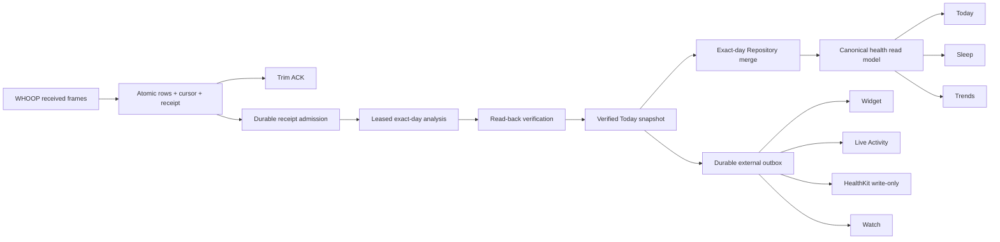

# Combined Phase 3–4 Implementation Plan

This is **one implementation batch and one draft PR**. The numbered sections are dependency order, not separate user review phases. Codex should use internal commits for bisectability and continue until the complete release candidate is green.

## End state



---

## 1. Install and adapt the tested pure core

Use `ReferenceCore/Sources/NoopPhase34Core` as the implementation source of truth. Either:

- add it as an internal local Swift package, or
- move the types into the existing appropriate targets while preserving tests.

Do not duplicate the state machines in app code.

Required kernels:

- `CivilDay` / `HealthCalendar`, including local 04:00 DST-safe rollover
- `CanonicalSleepScoreResolver`
- `VerifiedHealthProjection`
- `SnapshotPresentationIdentity`
- `HistoricalFingerprintV2Payload`
- `HistoricalReceiptEvidence` / sparse day planner
- `HistoricalAnalysisWork` / reducer
- `HistoricalPipelineCoordinator`
- `ExternalPublicationOutbox`
- `ConfirmedWriteTokenQueue`
- `RepositoryRefreshOutcome`
- `ExactDayCacheMerge`

---

## 2. Replace the fragmented score read paths

### Repository publication

During one Repository read/merge revision, load:

- imported WHOOP `sleep_performance`,
- NOOP V2 `noop_sleep_performance_v2`,
- NOOP legacy `sleep_performance`,
- optional provisional composite only when no persisted candidate exists.

Build `CanonicalHealthReadModel` with current `SleepPerformanceV2Prefs.mode`.

### Surface wiring

- Today reads `canonicalHealth.sleepScore(day:)`.
- Sleep hero and metric series read `canonicalHealth`.
- Trends Sleep series reads `canonicalHealth.sleepSeries`.
- Widget, Live Activity, Watch, and exports read `VerifiedHealthProjection`.
- The displayed point carries source/model provenance; no screen guesses by checking the latest day.

### Remove

- SleepView’s production Rest recomputation.
- Trends’ production use of generic `exploreSeries("sleep_performance")`.
- Today’s independent persisted-score precedence once parity tests pass.
- External surface reconstruction from `repo.days`.

---

## 3. Split Repository into exact, recent, and history-extent reads

Replace the days-only refresh contract with `RepositoryRefreshRequest`:

- exact days,
- optional recent dashboard count,
- history extent,
- explicit full-history migration.

### Launch

1. Hydrate Today snapshot.
2. Resume high-priority durable current-day work.
3. Publish exact changed days if work completes.
4. Load 90–120 recent days and aggregate history extent concurrently.
5. Never block Today on a 4,000-day query.

### Historical navigation

- Use history extent for bounds.
- Exact-load uncached days.
- Cache a bounded number of selected days.
- Sleep loads recent session groups and pages older groups on demand.

### Refresh result

Return typed authoritative and derivative statuses. Snapshot failure never makes a successful source publication fail.

---

## 4. Upgrade receipt identity and evidence

### Fingerprint V2

Hash only:

- device lineage,
- cursor epoch,
- trim scope,
- trim,
- protocol metadata,
- exact ordered frames,
- exact HISTORY_END frame.

Exclude:

- decoded timestamps,
- raw-capture policy,
- commit time,
- receipt UUID,
- parser-derived fields.

### Timestamp evidence

Persist independent timestamp buckets and the recorded time-zone identifier. Preserve explicit touched/heal days. Do not collapse sparse evidence into one global range.

### Replay

- Same scope/trim/fingerprint: return original receipt and allow ACK.
- Same scope/trim with a different fingerprint: explicit conflict; do not ACK.
- New lineage or cursor epoch: independent receipt identity.
- Equal-generation cursor writes are idempotent only when the edge matches exactly.

---

## 5. Replace checkpoint execution with a durable work journal

Add:

- `historicalReceiptConsumer`
- `historicalAnalysisWork`
- `analysisMutationJournal`
- work leases, attempts, retry time, error code, separate analysis/snapshot generations, and audit metadata.

### Transactional admission

In one database write:

1. Read all receipts after the scope’s consumer watermark.
2. Convert every receipt to evidence.
3. Compute exact affected days.
4. Insert or coalesce pending work.
5. Advance the admission watermark only after work is durable.

### Work selection

Priority order:

1. today/current overnight,
2. yesterday/latest wake day,
3. recent history,
4. deep history/full repair.

A source-lineage mismatch is quarantined with a reason, not retried forever.

---

## 6. Extract exact-day scoring without changing formulas

Refactor `IntelligenceEngine`:

- Extract the existing per-day scan/scoring body.
- Keep all formulas, baseline gates, source ownership, persistence, and diagnostics unchanged.
- Add `analyzeExactDays` accepting real civil-day windows and recorded timezone.
- Keep `analyzeRecent` as a compatibility adapter for unrelated callers.

### Baselines

- Raw streams: exact affected days only.
- Baseline history: indexed daily aggregates.
- No 21-day raw rescan after every burst.

### New result

After score rows commit, record a semantic mutation row in `analysisMutationJournal`. Its AUTOINCREMENT value is
the analysis generation. Return a typed mutation receipt with analyzed days, algorithm version, consumed
receipt generation/frontier, and that durable analysis generation.

---

## 7. Verify before publishing

After scoring:

- read Recovery back from the correct writer/day,
- require Strain V2 and correct physiological day,
- read canonical Sleep score and duration independently,
- verify algorithm/source/frontier/generation,
- verify authoritative absence/deletion.

Then:

1. commit/update the verified Today snapshot,
2. mark the snapshot generation on durable work,
3. exact-publish changed Repository days,
4. mark Repository publication,
5. persist the exact verified projection and every downstream outbox row in one transaction,
6. persist `verifiedSnapshotCommit(contextId, analysisGeneration)` so a restart reuses the same snapshot generation,
7. mark analysis work complete and release its lease.

Destination delivery retries belong to the outbox worker. They do not rescore the day. The strap trim ACK has
already occurred after the raw/cursor/receipt transaction and does not wait for any step in this section.

---

## 8. Publish external surfaces through a durable outbox

Persist destination identity by delivery semantics:

```text
Widget / Live Activity / Watch:
contextId + snapshotGeneration + destination

HealthKit:
contextId + analysisGeneration + destination + exact changed-day set
```

Latest-state destinations supersede older pending generations. HealthKit rows never supersede another analysis
mutation because every changed-day set must be delivered once. All destinations read the exact stored
`VerifiedHealthProjection`. HealthKit is write-only on this path and cannot trigger a Health import or permission
prompt. Long HealthKit/Watch calls renew their destination lease. Projection replay compares decoded semantic
values, and pruning retains every projection referenced by nonterminal outbox or snapshot-commit rows.

Foreground/background lifecycle events signal workers. They do not manufacture broad Repository refreshes.

---

## 9. Fix BLE callback and source lifecycle seams

- Retire confirmed-write tokens before stale-generation return.
- Remove tokens on disconnect/source epoch change.
- Prune abandoned tokens.
- Retire the old receipt scope and quarantine old-lineage analysis work on re-pair.
- Delete new work/outbox rows during logical source-family deletion.
- Harden `setActive` to reject a missing target without demoting the existing active device.

---

## 10. Delete the superseded architecture

After parity and crash tests pass, remove:

- `HistoricalAnalysisCheckpoint` and its migration/table read/write APIs.
- `HistoricalReceiptAnalysisConsumer` staged-payload model.
- `CommittedAnalysisRunPlanner` from the historical receipt path.
- global min/max `CommittedAnalysisWindow` expansion for receipt work.
- broad post-backfill Repository refresh.
- direct production score selection in Today/Sleep/Trends.
- external projection built independently from Repository arrays.

Compatibility adapters may remain only where a non-historical caller still requires them and must be marked for later removal.

---

## Completion definition

The combined PR is done only when:

- all existing retained tests pass,
- all included regression/crash tests pass,
- source audits pass,
- app/extensions compile,
- no release-blocking grep rule fires,
- physical overnight matrix passes,
- instrumentation proves exact-day reads and bounded startup,
- Today/Sleep/Trends/widget/watch show the same score generation.
