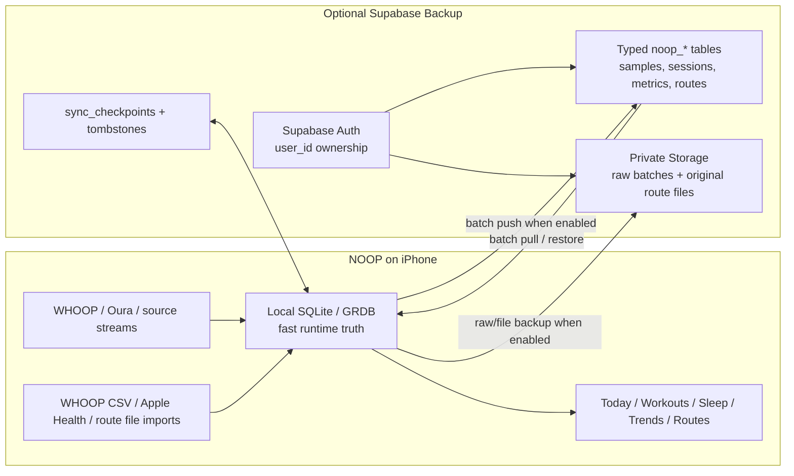

# Noop Migration: Supabase Schema, Loop Gap, Route Direction

Date: 2026-07-08

## Current Status

- Loop is retired in `projects/loop`; no repo deletion or evidence cleanup was done.
- `com.loop.swift` was uninstalled from Easton's named iPhone and verified absent afterward.
- Supabase project `Easton's Loop` (`uurqmyselkznaycsuxjg`) is cleared: public Loop tables are zero rows, Storage bucket `loop-raw-payloads` is zero objects, and leftover Auth user/session/token rows are zero.
- Storage was cleared through the official Storage API empty-bucket endpoint after a short-lived bucket-scoped policy; the temporary policies were dropped and verified absent. Direct SQL deletion remains the wrong path because Supabase's storage guard prevents orphaned objects.
- Noop reference used: `projects/noop-upstream` current worktree.
- Generated visual direction: `outputs/2026-07-08/visuals/noop-routes-design-direction/assets/noop-routes-design-direction.png`.

## Noop Local Tables Observed

Authority: `projects/noop-upstream/Packages/WhoopStore/Sources/WhoopStore/Database.swift`.

Noop's Apple-platform store is GRDB/SQLite. The migrator currently creates or mutates these logical tables:

| Group | Noop local tables / fields | Purpose |
|---|---|---|
| Device/source identity | `device`, `pairedDevice`, `dayOwnership` | Known straps/sources, active device registry, source ownership per day. |
| Live decoded streams | `hrSample`, `rrInterval`, `event`, `battery` | HR, RR intervals, generic events, battery/SOC/charging. |
| Raw/biometric streams | `spo2Sample`, `skinTempSample`, `respSample`, `gravitySample`, `stepSample`, `ppgHrSample`, `sleepStateSample` | WHOOP 5/MG sensor streams and derived PPG HR. |
| Raw proof/outbox | `rawBatch`, `cursors` | Compressed raw frame batches and high-water cursors. |
| Derived health facts | `sleepSession`, `dailyMetric`, `metricSeries` | Sleep sessions, daily charge/recovery/strain/sleep vitals, generic long-format metric points. |
| User/import records | `journal`, `workout`, `appleDaily`, `labMarker` | Journal answers, workout summaries, Apple Health daily aggregates, user-entered lab readings. |
| Live Session beta | `liveSession` | Silent Guardian sessions: recovery-gated HR band, in/below/above time, cue counts, HR source. |
| Route/GPS support | Apple iOS route support exists outside the SQL migrator; Android has `workout.routePolyline`; iOS `Info.plist` says route data stays on-device. | For cloud, model routes explicitly instead of burying them in workout rows. |

Notable code truth:

- `Database.swift` includes migrations through `v22-live-session`.
- `WhoopStoreInfo.schemaVersion` still says `18`, while the migrator has v22 migrations. Treat this as a Noop cleanup bug before using schema-version checks for cloud/backup.
- Android has additional parity surfaces not represented the same way in Apple SQL: `workout.routePolyline`, `dismissedWorkout`, and `dismissedSleep`.

## Supabase Tables Needed For Noop

Do not copy Loop's single `loop_domain_records` JSON table as the whole design. For Noop, use first-class typed tables for the app's main read paths, plus a domain-record/outbox lane for forward compatibility.

Minimum useful Supabase schema:

| Supabase table | Captures | Natural key / conflict key |
|---|---|---|
| `noop_profiles` | User profile, timezone, unit prefs, app settings envelope. | `user_id` |
| `noop_devices` | `device` + `pairedDevice`: strap/source identity, model, nickname, capabilities, status, peripheral ID. | `user_id, device_id` |
| `noop_day_ownership` | Which source owns each displayed/scored local day. | `user_id, day` |
| `noop_hr_samples` | `hrSample`. | `user_id, device_id, ts` |
| `noop_rr_intervals` | `rrInterval`. | `user_id, device_id, ts, rr_ms` |
| `noop_events` | `event`. | `user_id, device_id, ts, kind` |
| `noop_battery_samples` | `battery`, including charging. | `user_id, device_id, ts` |
| `noop_spo2_samples` | Raw red/IR SpO2 evidence, not a percent. | `user_id, device_id, ts` |
| `noop_skin_temp_samples` | Raw skin-temp stream. | `user_id, device_id, ts` |
| `noop_resp_samples` | Raw respiration stream. | `user_id, device_id, ts` |
| `noop_gravity_samples` | Gravity/accelerometer stream. | `user_id, device_id, ts` |
| `noop_step_samples` | Step counter plus optional activity class. | `user_id, device_id, ts` |
| `noop_ppg_hr_samples` | PPG-derived HR estimate/confidence. | `user_id, device_id, ts` |
| `noop_sleep_state_samples` | Raw band sleep-state stream. | `user_id, device_id, ts` |
| `noop_raw_batches` | `rawBatch` metadata; blob goes to Storage. | `user_id, batch_id` |
| `noop_sleep_sessions` | `sleepSession`, including user edits and per-epoch JSON fields. | `user_id, device_id, start_ts` |
| `noop_daily_metrics` | `dailyMetric`: recovery, strain, sleep totals, HRV, RHR, SpO2 %, skin-temp delta, resp rate, steps, active kcal estimate. | `user_id, device_id, day` |
| `noop_metric_series` | `metricSeries` long-format cells. | `user_id, device_id, day, key` |
| `noop_journal_entries` | Journal yes/no/numeric responses. | `user_id, device_id, day, question` |
| `noop_workouts` | Workout summary rows, source, HR stats, zones, strain, distance. | `user_id, device_id, start_ts, sport` |
| `noop_workout_routes` | Route manifest: route id, workout key, source file, official/verified flags, bounds, distance, elevation, point count, encoded polyline/hash. | `user_id, route_id` |
| `noop_route_points` | Optional expanded route points when not storing only encoded polyline. | `user_id, route_id, point_index` |
| `noop_apple_daily` | Apple Health daily aggregates. | `user_id, device_id, day` |
| `noop_lab_markers` | Lab Book rows. | `user_id, device_id, marker_key, taken_at, source` |
| `noop_live_sessions` | Silent Guardian / Live Session beta rows. | `user_id, device_id, start_ts` |
| `noop_tombstones` | Dismissed sleep/workout and deleted rows across devices. | `user_id, domain, local_id` |
| `noop_sync_checkpoints` | Per-device push/pull cursors and policies. | `user_id, device_id, scope` |
| `noop_domain_records` | Escape hatch for future typed migrations and imported records not yet modeled. | `user_id, domain, local_id` |

Storage bucket:

- `noop-raw-batches`: private bucket for compressed raw batch blobs.
- Optional `noop-route-files`: private bucket for original GPX/FIT/TCX/GeoJSON uploads when provenance matters.

## What Noop Is Missing That Loop Had

| Missing in Noop | Loop had | Why it matters |
|---|---|---|
| Cloud durability/account sync | Supabase auth, RLS, public cloud tables, raw Storage bucket, sync checkpoints/outbox/cache. | Noop is intentionally offline; switching to Noop means adding a cloud plane if Easton wants cross-device restore and durable backup. |
| First-class cloud conflict/replay mechanics | `cloud_sync_outbox`, `cloud_remote_domain_records`, `cloud_sync_checkpoints`, raw upload manifests. | Needed so phone-local writes can replay safely and hydrate a second device without live querying on every screen. |
| Detailed algorithm/provenance audit tables | `algorithm_definitions`, `algorithm_runs`, `metric_provenance`, `metric_debug_features`, calibration tables. | Noop has transparent code and local metrics, but less persistent "why did this score happen?" auditability than Loop's schema. |
| Strength Trainer schema | `strength_exercises`, routines, programs, session details, sets, set HR samples, set metrics. | Noop stores workouts, but Loop had a more WHOOP Strength-Trainer-shaped data model. |
| First-class route point schema in Apple store | Loop has `activity_route_points`; Noop iOS routes appear app/file-level, while Android has `workout.routePolyline`. | For official-looking route records and provenance, add route manifest + point tables rather than hiding GPS in a workout note/polyline. |
| Capture/debug session ledgers | `capture_sessions`, `ble_raw_notifications`, `historical_range_polls`, `debug_sessions`, `debug_commands`, `debug_events`. | Loop retained more proof/debug scaffolding for WHOOP protocol work. Noop is cleaner product code, but less forensic. |
| Planned workouts | Loop had `planned_workouts`. | If Noop becomes the main app, training plans need a native durable model. |
| Health export status records | Loop had `activity_health_exports`. | Useful if Noop writes workouts/metrics back to Apple Health and needs retry/status UI. |
| Cloud-backed raw retention policy | Loop had local/cloud retention and raw manifest status fields. | Noop has local raw pruning, but no cloud-backed "uploaded/verified/compact" lifecycle yet. |

Noop also has things Loop did not have as cleanly:

- `labMarker` Lab Book.
- `metricSeries` long-format metric explorer substrate.
- `dayOwnership` source-owner model.
- `liveSession` / Silent Guardian session table.
- Better documented offline/no-account privacy stance.

## Architecture



## Route Design Direction

Place the Sudanese route under Workouts as a first-class `Routes` sub-surface, not under generic files/settings.

Recommended route UX:

- Workouts tab gets a `Routes` row/card in the Special section.
- Route detail shows map, elevation, effort/pace chips, distance, source badges.
- Provenance sheet shows file type, point count, continuity checks, imported timestamp, privacy status, and Supabase backup status.
- "Official" should mean verified/provenanced source metadata, not fake seals or government imagery.
- Database should store route provenance separately from the workout summary so an imported official route can be audited, reattached, or backed up without losing its metadata.

Generated concept board:

- Asset: `outputs/2026-07-08/visuals/noop-routes-design-direction/assets/noop-routes-design-direction.png`
- QA copy: `outputs/2026-07-08/visuals/noop-routes-design-direction/qa/noop-routes-design-direction-qa.png`

Prompt used:

```text
Use case: ui-mockup / infographic-diagram
Asset type: full-slide 16:9 design direction board for a mobile app feature
Primary request: Create a polished design direction board showing where a route feature called "Sudanese Repo Route" would live inside NOOP and how to make it look official, based on NOOP's current views.
Design language: NOOP-inspired mobile UI: dark charcoal app surfaces, soft purple-to-russet gradient background, rounded dark cards, circular liquid metric gauges, uppercase spaced metric labels, small pill source tags, glassy bottom navigation, subtle cyan/green/purple accents, crisp iOS-style typography. Premium first-party health app, not generic SaaS.
Composition: show 3 tall phone-screen mockups side by side plus a small architecture/provenance strip below. Screen 1: Workouts list with a "Routes" entry and highlighted "Sudanese Repo Route" card. Screen 2: Route detail with map line, elevation mini-chart, pace/effort chips, and a source pill. Screen 3: Provenance / official record sheet with verification checklist, imported GPX/GeoJSON metadata, privacy status, and Supabase sync state.
Required visible text: "NOOP Routes", "Sudanese Repo Route", "Official Source", "Verified GPX", "Private On-device", "Supabase Sync", "Map", "Effort", "Pace", "Elevation", "Provenance".
Official look direction: use a neutral verification badge and document metadata styling; do not use or imitate any government seal, agency logo, national flag, or official emblem.
Architecture strip: small clean flow at bottom: "Route file" -> "NOOP importer" -> "Local SQLite" -> "Supabase backup" -> "Route detail".
Constraints: readable UI text, no fake government branding, no real personal data, no stock-photo people, no decorative blobs, no AI robot icons, no excessive tiny text, no watermark.
Quality: high; polished product concept; shippable mobile UI mockup; readable at slide-view size.
```
