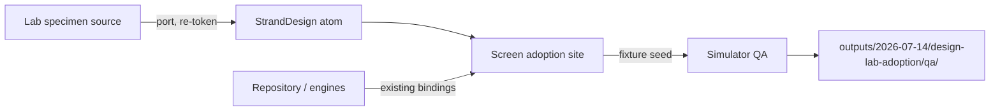

# Plan 008 — Design Lab Adoption

Read `spec.md` for requirements, `research.md` for locked decisions, `data-model.md`
for state/inventory semantics, `contracts/component-contracts.md` before touching
StrandDesign, and `rollback.md` before starting any phase.

## Technical Context

- SwiftUI iPhone app; iOS 16 floor for the app target, StrandDesign package shared with
  macOS. Lab source floor is iOS 17 — every ported API is re-checked against the app
  floor (`sensoryFeedback` and `contentTransition(.numericText)` need `#available`
  gates or the package's existing haptic/motion fallbacks; see research.md D7).
- Authority chain: lab (`projects/noop-design-lab/NOOPDesignLab/*.swift`) for grammar
  and motion → `StrandPalette`/`StrandFont`/`StrandMotion` for tokens → screens bind
  real data.
- State authorities unchanged: `Repository` (GRDB), `AppModel`, `LiveState`,
  memoized `SleepModel`/`StressModel`/`DaytimeStress`.
- Navigation unchanged: `RootTabView` (tabs 0–3 + `QuickAction` + PaperTabBar),
  `NavRouter` destinations, spec-004 workout coordinator.
- Working tree may be dirty with concurrent spec work (005–007 execution). Diff before
  each patch; never absorb unrelated changes.

## Constitution / Project Gates

- Strain accent, strain scale, recovery/sleep/stress engine math: untouchable.
- Every displayed value has a real engine/repository source or an honest empty state.
- Surgical patches; read files before editing; no opportunistic refactor of screens
  not in the mapping table.
- No completion claims without build + tests + simulator screenshot evidence.
- StrandDesign stays visual-only; anything holding engine state stays in the app
  target (spec-004 boundary).

## Architecture

1. **Promote** lab atoms into `Packages/StrandDesign/Sources/StrandDesign/` as new
   files (`ValueToken.swift`, `MicroPrimitives.swift`, `PaperSearchField.swift`,
   `PaperToast.swift`) per contracts. Additive only.
2. **Upgrade** existing package components in place (`SegmentedPillControl`,
   `StatePill`/`StatusBadge` pulse, `PipBar` unchanged as canonical rail) preserving
   public API so macOS callers compile untouched.
3. **Adopt per screen** in dependency order (states/toast → sleep → stress → trends →
   navigation → shared-micro convergence), replacing ad-hoc implementations at each
   audited site and deleting the local copies in the same task.
4. **Converge** the audit list to zero and re-run it once at the end (guards against
   concurrent specs reintroducing duplicates).

## Ordered Migration

| Order | Phase | Delivers | Verification gate |
|---|---|---|---|
| 0 | Evidence | Before-screenshots of every adoption site; duplicate audit committed to research.md | No code touched; audit reviewed |
| 1 | Package atoms | FR-001/002/003 promotions + upgrades, previews, package tests | Package builds both platforms; snapshot previews inspected; macOS app compiles |
| 2 | States + toast | PaperToast, undo-banner migration, operation cards, live-vital pills (US4) | Toast timing/cancellation tests; screenshots |
| 3 | Sleep | US2 FR-005…008 | SleepView fixture screenshots (full/naps/empty/low-confidence); Reduce Motion pass |
| 4 | Stress | US3 FR-009…012 | StressView + Today card fixture screenshots incl. calibrating + zero-hours |
| 5 | Trends + navigation | US5 FR-017/018 | Trends rows math test; day-navigator motion capture |
| 6 | Shared-micro convergence | FR-019 across mapping-table screens | grep audit = zero; per-screen spot screenshots |
| 7 | QA + cleanup | Full matrix, dead-code sweep, coverage note in lab repo | SC-001…005 evidence recorded in tasks.md |

Phases 3, 4, 5 are independent after Phase 2 and may be reordered if a concurrent
spec locks one of those screens; Phase 6 must run last-but-one; Phase 7 last.

## Data Flow (adoption-time)

## File Strategy

- **Create (package):** `ValueToken.swift`, `MicroPrimitives.swift`
  (MicroBadge/MicroStatusDot/ProgressDots/MicroIconButton), `PaperSearchField.swift`,
  `PaperToast.swift` — each with `#Preview` and doc comments naming the lab source.
- **Modify (package):** `SegmentedPillControl` (thumb + haptic), `StatePill.swift` /
  `PaperComponents.swift` (pulse option), nothing else.
- **Modify (app):** `SleepView.swift` (rows/ledger/stage-dim presentation only),
  `StressView.swift` (daytime section, totals rail, legend), `TodayView.swift`
  (stress-card strip treatment), `TrendsView.swift` (+summary rows),
  `ScreenScaffold.swift`/`DayNavBar` call sites, `LiveView.swift` (vital pill),
  `BackupSyncView.swift`, plus the audited shared-micro sites listed in research.md.
- **Never:** engine files, `Repository`/GRDB, BLE, widgets, `Palette.swift` tokens,
  workout coordinator files.

## Verification

- Package unit tests: toast dwell/cancel/restart, ProgressDots identity, ValueToken
  accessibility label composition, SegmentedPillControl selection callbacks.
- App unit tests: trends summary-row derivation equals charted series; sleep/stress
  presentation mappers (band color, delta tint) pinned.
- UI/manual: quickstart.md journeys with the standard fixture seed; evidence under
  `outputs/2026-07-14/design-lab-adoption/qa/{before,atoms,sleep,stress,trends,states,final}/`.
- Device gates: `NOOP-Paper-iPhone16Pro-QA` simulator (00522DAA-FDB8-4DC9-866C-71C7862C354D)
  as primary; one pass on iPhone 17 Pro Max (602CD04D-E0CD-4A41-986C-74427759C06A) for
  large-device layout; light + dark + XL type + Reduce Motion on the primary.
- Builds: iOS app, macOS app, StrandDesign package tests — all green per phase.

## Failure-State Verification (explicit)

Each phase's gate includes its failure states from spec.md Edge Cases: empty sleep
night, calibrating stress, zero scored hours, save-failure operation card, offline
vital, toast double-fire, Reduce Motion. A phase without its failure-state screenshots
does not pass.

## Rollback

Summarized here; full procedure in `rollback.md`.

- Phases land as separate commits (or PR slices) in migration order; every phase is
  independently revertible because promotions are additive and screen adoptions don't
  change data flow.
- Package upgrades preserve public API, so reverting a screen adoption never requires
  reverting the package.
- Ad-hoc implementations are deleted in the same commit that replaces them; reverting
  that commit restores the previous presentation wholesale.
- Abort criterion: any engine-output regression (score, series, duration values
  differing pre/post adoption on the same fixture) stops the phase and triggers
  rollback of that phase only.

## Risks and Mitigations

- **iOS 16 floor vs lab's iOS 17 APIs:** gate `sensoryFeedback`/`numericText` behind
  `#available`; fall back to `StrandHaptic` and opacity transitions (research D7).
- **Concurrent specs rewriting the same screens:** phase ordering is re-checkable; the
  Phase 6 audit re-run catches drift; coordinate via TASKS.md before Phase 3+.
- **Motion regressions at sensor frequency:** pulse/reveal animations live in leaf
  views; never attach `.animation` to containers observing live HR.
- **macOS breakage from package changes:** additive promotions + API-preserving
  upgrades; macOS build is part of every phase gate.
- **Scope creep into engine code:** the mapping table is exhaustive; anything not
  listed is out of scope by definition.
